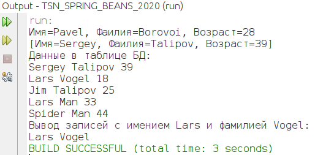
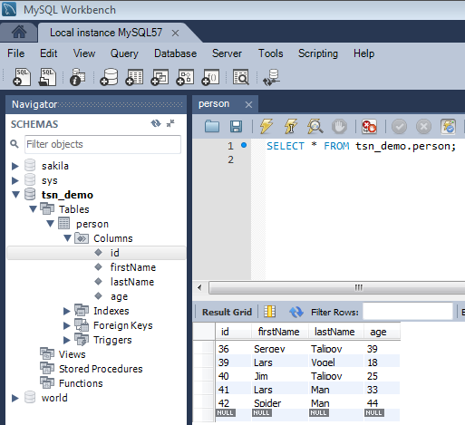

# TSN_SPRING_BEANS_2020
Пример работы с базами данных в Java через SPRING BEANS

[Apache NetBeans 12 + OpenJDK 11 (linux)]





Скрипт для создания таблицы:
```
CREATE TABLE IF NOT EXISTS `tsn_demo`.`person` (
  `id` INT(11) NOT NULL AUTO_INCREMENT,
  `firstName` VARCHAR(45) NULL DEFAULT NULL,
  `lastName` VARCHAR(45) NULL DEFAULT NULL,
  `age` INT(11) NULL DEFAULT NULL,
  PRIMARY KEY (`id`))
ENGINE = InnoDB
AUTO_INCREMENT = 85
DEFAULT CHARACTER SET = latin1
```
